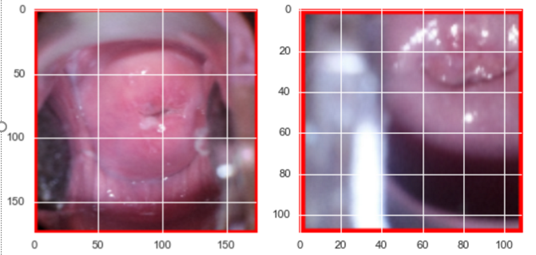
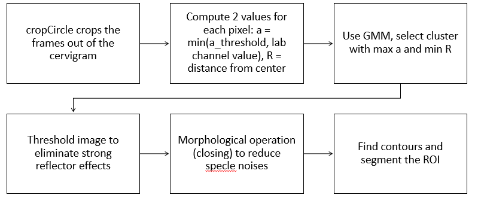

# Cervical-Scan-CNN
1. Datasets:

We downloaded the dataset "train.7z" from kaggle’s Intel & MobileODT Cervical Cancer Screening https://www.kaggle.com/c/intel-mobileodt-cervical-cancer-screening. The datasets consist of 250 images of Type I, 781 images of Type II, and 450 images of Type III. Most of the images contain irrelevant details to our training algorithm such as medical devices and unidentifiable tissue, thus we used the method specified by Greenspan et al (citation) to segment the cervix as smaller sub-images containing only the region of interest (ROI). 

2. Procedure pipeline:

* Segmentation of images for ROI (in preprocessing.py): since a lot of our file preprocessing.py will read the images from directory "input/" and output segmented images of size 58*58. A lot of our codes for cervix have to give credit to this kaggle's kernel https://www.kaggle.com/chattob/intel-mobileodt-cervical-cancer-screening/cervix-segmentation-gmm. Below is a flowchart of the image processing procedure: 

* Split the dataset into training set (793 images), tuning set (199 images) and testing set (489 images) 

* Constructing the classifier: in testRuns.py we have different functions for 3 methods of classification
   * Conconvolutional Neural Network (CNNplot): We used implementation of the convolutional neural networks from keras with 2DConvolutional, MaxPooling, Dense, Dropout and BatchNormalization from keras and test the 
   * Bags of Words (BOWS): We used numpy's lib.stride_tricks.as_strided to extract 5x5 patches from every image. From the patches we used scipy.cluster.vq to do vq.k-means clustering to build the codebook and vq.vq to perform cluster assignment for each image's set of patches to compute its histogram. 
   * Multi-layer Perceptron (MLPR): After reshaping the dimension of the input X into a 2D array, we used implementation from sklearn.neural_network.MLPClassifier, we used a single layer perceptron with 16 nodes. 

3. Running the main program:
With the code files "testRuns.py" and "preprocessing.py" in the same directory with "input", the command line to run the program should be: "python testRuns.py" and the program will execute a run for 3 classifiers BOWS, CNN and MLP. 
